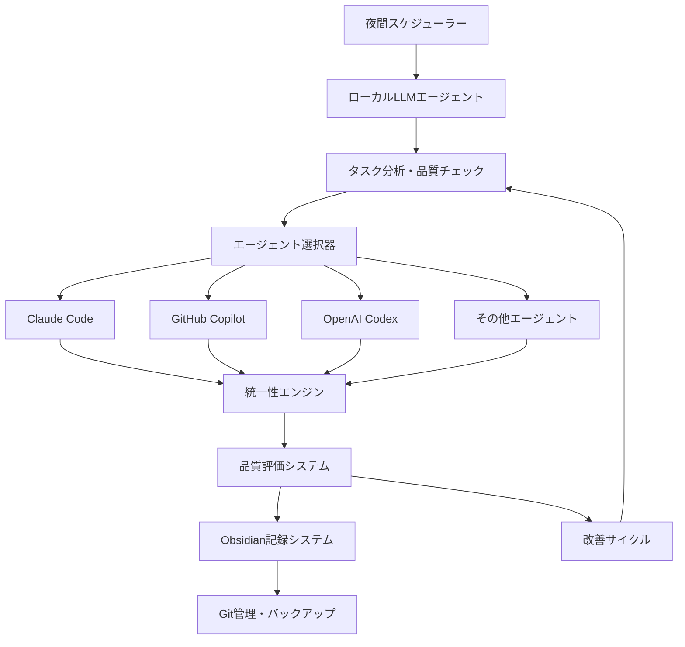

# 設計ドキュメント

## 概要

自律夜間開発システムは、ローカル LLM（LM Studio）を中心とした指揮系統と、複数の外部コーディングエージェントを連携させる分散アーキテクチャを採用します。Obsidian ベースの永続化記憶システムにより、プロジェクト固有の知識を蓄積し、統一性エンジンによってコード品質を維持します。

## アーキテクチャ

### システム全体構成



### 主要コンポーネント

#### 1. ローカル LLM エージェント（指揮系統）

- **役割**: 開発全体の指揮、タスク分析、品質チェック
- **技術**: LM Studio（CodeLlama 13B 等）
- **責任**:
  - タスクの優先順位付け
  - 品質基準の評価
  - 改善サイクルの管理
  - 失敗原因の分析

#### 2. マルチエージェント管理システム

- **動的検出機能**: 利用可能なエージェントの自動スキャン
- **優先順位付け**: 認証状態・プラン情報・機能による順位決定
- **フォールバック機能**: 30 秒以内の代替エージェント切り替え
- **負荷分散**: 複数エージェントでの並行実行

#### 3. 統一性エンジン

- **リアルタイムチェック**: コーディング段階での統一性確保
- **学習型ルール**: プロジェクト固有パターンの自動抽出
- **フィードバックループ**: 違反から学習して改善

#### 4. Obsidian コンテキスト管理

- **プロジェクト記憶**: コードパターン、統一性ルール、開発履歴
- **永続化**: Markdown ファイルベースの構造化情報
- **学習機能**: 成功・失敗パターンの蓄積

## コンポーネントと インターフェース

### 1. NightScheduler（夜間スケジューラー）

```python
class NightScheduler:
    def __init__(self):
        self.execution_window = (22, 6)  # 22:00-06:00
        self.max_changes_per_night = 10
        self.task_queue = PriorityQueue()

    async def start_night_execution(self):
        """夜間実行の開始"""
        pass

    async def monitor_execution(self):
        """実行監視とリソース管理"""
        pass
```

### 2. LocalLLMAgent（ローカル LLM エージェント）

```python
class LocalLLMAgent:
    def __init__(self, model_path: str):
        self.model = self.load_model(model_path)
        self.quality_threshold = 0.85

    async def analyze_task(self, task: Task) -> TaskAnalysis:
        """タスク分析と実行計画策定"""
        pass

    async def evaluate_quality(self, code: str) -> QualityScore:
        """コード品質評価"""
        pass

    async def analyze_failure(self, failure: FailureInfo) -> ImprovementPlan:
        """失敗原因分析と改善計画"""
        pass
```

### 3. ClaudeAgent（Claude Code 専用エージェント - Phase 1）

```python
class ClaudeAgent:
    def __init__(self):
        self.cli_command = "claude"
        self.max_retries = 3
        self.timeout = 300  # 5 minutes

    async def check_authentication(self) -> bool:
        """Claude認証状態の確認"""
        pass

    async def execute_task(self, task: Task) -> ExecutionResult:
        """Claudeを使用したタスク実行"""
        pass

    async def generate_code(self, prompt: str, context: str) -> str:
        """コード生成"""
        pass
```

### 4. AgentManager（将来拡張用 - Phase 2）

```python
class AgentManager:
    def __init__(self):
        self.agents = {"claude": ClaudeAgent()}
        # 将来拡張: copilot, codex, etc.

    async def execute_with_primary(self, task: Task) -> ExecutionResult:
        """プライマリエージェント（Claude）での実行"""
        pass

    # 将来実装: フォールバック機能
    # async def execute_with_fallback(self, task: Task) -> ExecutionResult:
```

### 5. ConsistencyEngine（統一性エンジン）

```python
class ConsistencyEngine:
    def __init__(self, project_context: ProjectContext):
        self.patterns = project_context.patterns
        self.rules = project_context.rules
        self.consistency_threshold = 0.85

    async def extract_patterns(self, codebase: str) -> List[CodePattern]:
        """既存コードパターンの抽出"""
        pass

    async def check_consistency(self, code: str) -> ConsistencyScore:
        """統一性チェック"""
        pass

    async def suggest_corrections(self, violations: List[Violation]) -> List[Correction]:
        """修正提案"""
        pass
```

### 6. ObsidianManager（Obsidian 管理）

```python
class ObsidianManager:
    def __init__(self, vault_path: str):
        self.vault_path = vault_path
        self.project_structure = self.init_structure()

    async def save_pattern(self, pattern: CodePattern, project: str):
        """パターンの保存"""
        pass

    async def load_context(self, project: str) -> ProjectContext:
        """プロジェクトコンテキストの読み込み"""
        pass

    async def record_execution(self, execution: ExecutionRecord):
        """実行記録の保存"""
        pass
```

## データモデル

### 1. Task（タスク）

```python
@dataclass
class Task:
    id: str
    description: str
    priority: int
    estimated_quality: float
    project_context: ProjectContext
    requirements: List[str]
    constraints: List[str]
```

### 2. QualityScore（品質スコア）

```python
@dataclass
class QualityScore:
    overall: float  # 0.0-1.0
    code_quality: float
    consistency: float
    test_coverage: float
    security: float
    performance: float
```

### 3. ExecutionResult（実行結果）

```python
@dataclass
class ExecutionResult:
    task_id: str
    success: bool
    quality_score: QualityScore
    generated_code: str
    agent_used: str
    execution_time: float
    improvements_made: List[str]
    errors: List[str]
```

### 4. ProjectContext（プロジェクトコンテキスト）

```python
@dataclass
class ProjectContext:
    project_name: str
    patterns: List[CodePattern]
    consistency_rules: List[ConsistencyRule]
    development_history: List[HistoryEntry]
    lessons_learned: List[Lesson]
    success_patterns: List[SuccessPattern]
```

## エラーハンドリング

### 1. 安全性チェック

- **危険コマンド検出**: 削除・フォーマット系コマンドの自動ブロック
- **ファイル変更制限**: 重要ファイルの保護
- **リソース監視**: CPU 80%、メモリ 8GB 制限

### 2. 品質管理

- **品質閾値**: 0.85 未満のコードは改善サイクルへ
- **改善サイクル**: 最大 3 回の自動改善試行
- **朝承認キュー**: 改善失敗時の手動レビュー待ち

### 3. バックアップ・復旧

- **自動バックアップ**: 夜間実行前の完全バックアップ
- **Git 管理**: 夜間専用ブランチでの作業
- **ロールバック**: Git reset --hard による完全復元

## テスト戦略

### 1. 単体テスト

- 各コンポーネントの独立テスト
- モック使用による外部依存の分離
- 品質スコア計算の正確性検証

### 2. 統合テスト

- エージェント間の連携テスト
- フォールバック機能の動作確認
- 並行実行時の競合解決テスト

### 3. エンドツーエンドテスト

- 夜間実行の完全フローテスト
- 品質改善サイクルの動作確認
- 学習機能の効果測定

### 4. 安全性テスト

- 危険操作の検出・ブロック確認
- バックアップ・復旧機能の検証
- リソース制限の動作確認

### 5. パフォーマンステスト

- 単一タスク 30 分以内の実行確認
- 並行実行時のリソース使用量測定
- 大規模プロジェクトでの動作確認
