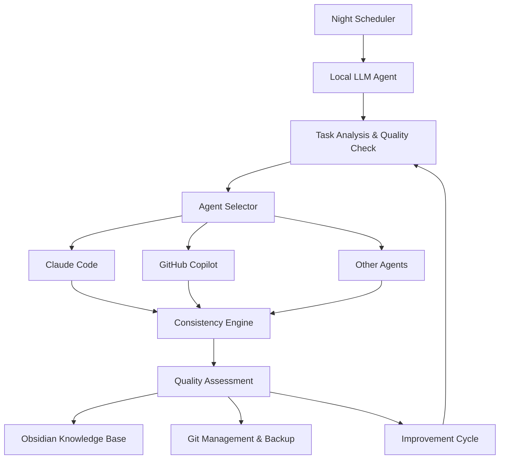

# Nocturnal Agent / 夜間自律開発システム

🌙 **Autonomous Night Development System** - Let your code write itself while you sleep!  
🌙 **夜間自律開発システム** - 睡眠中にコードが自動で開発されます！

Nocturnal Agent is an intelligent system that performs development tasks autonomously during nighttime hours (10 PM - 6 AM), using local LLM orchestration with multi-agent coordination for cost-effective and safe automated coding.

Nocturnal Agentは、夜間時間帯（22:00-06:00）に開発タスクを自律的に実行するインテリジェントシステムです。ローカルLLMオーケストレーションとマルチエージェント連携により、コスト効率的で安全な自動コーディングを実現します。

## 🎯 Features / 機能

- **🌙 Night Automation / 夜間自動化**: Automatic execution during 22:00-06:00 window / 22:00-06:00の時間帯での自動実行
- **🤖 Multi-Agent Orchestration / マルチエージェント統合**: Coordinates Claude Code, GitHub Copilot, and other coding agents / Claude Code、GitHub Copilot等のコーディングエージェントを統合
- **🧠 Local LLM Intelligence / ローカルLLM知能**: Uses LM Studio for cost-effective task planning and quality assessment / LM Studioを使用したコスト効率的なタスク計画と品質評価
- **📊 Quality Assurance / 品質保証**: Maintains 0.85+ quality threshold with 3-cycle improvement system / 3サイクル改善システムで0.85以上の品質閾値を維持
- **🔒 Safety First / 安全性重視**: Automatic backups, dangerous command blocking, resource limits / 自動バックアップ、危険コマンドブロック、リソース制限
- **💡 Learning System / 学習システム**: Obsidian-based knowledge accumulation for project-specific patterns / Obsidianベースのプロジェクト固有パターン知識蓄積
- **⚖️ Cost Control / コスト管理**: $10/month budget with 90%+ free tool preference / 月額10ドル予算で90%以上の無料ツール優先使用
- **🔀 Parallel Execution / 並列実行**: Up to 5 concurrent branches based on quality confidence / 品質信頼度に基づく最大5並列ブランチ実行
- **📝 GitHub Spec Kit Integration / GitHub Spec Kit統合**: Optional spec-driven development when explicitly requested / 明示的な要求時のオプションの仕様駆動開発

## 🚀 Quick Start / クイックスタート

### Prerequisites / 前提条件

- Python 3.9+ / Python 3.9以上
- [LM Studio](https://lmstudio.ai/) with a code model (recommended: CodeLlama 13B) / コードモデル付きLM Studio（推奨：CodeLlama 13B）
- [Claude Code CLI](https://docs.anthropic.com/en/docs/claude-code) (authenticated) / Claude Code CLI（認証済み）
- Git repository for development / 開発用Gitリポジトリ

### Installation / インストール

```bash
# Clone the repository / リポジトリのクローン
git clone <repository-url>
cd nocturnal-agent

# Install dependencies / 依存関係のインストール
pip install -e .

# Initialize configuration / 設定の初期化
nocturnal init

# Check system status / システム状態の確認
nocturnal status
```

### Configuration

Edit `config/nocturnal-agent.yaml` to customize:

```yaml
# Core settings
project_name: "your-project"
working_directory: "/path/to/your/project"

# LLM settings
llm:
  api_url: "http://localhost:1234/v1"
  model_path: "models/codellama-13b"

# Night schedule
scheduler:
  start_time: "22:00"
  end_time: "06:00"
  max_changes_per_night: 10

# Quality thresholds
quality:
  overall_threshold: 0.85
  consistency_threshold: 0.85
```

## 🏗️ Architecture



## 📋 Current Implementation Status

- [x] 1. Project foundation and core interfaces
  - [x] Python 3.9+ project structure (src/, tests/, config/)
  - [x] Basic data models (Task, QualityScore, ExecutionResult, ProjectContext)
  - [x] Configuration management system (YAML support)

- [ ] 2. Local LLM Agent implementation
- [ ] 3. CLI coding agent integration system
- [ ] 4. Consistency engine implementation
- [ ] 5. Obsidian integration system
- [ ] 6. Quality improvement cycle implementation
- [ ] 7. Night scheduler implementation
- [ ] 8. Safety and backup system implementation
- [ ] 9. Cost management system implementation
- [ ] 10. Parallel execution features
- [ ] 11. Test suite implementation
- [ ] 12. Configuration and documentation

## 🎮 Usage / 使用方法

### Adding Tasks / タスクの追加

```bash
# Add a simple task / シンプルなタスクの追加
nocturnal add-task -t "Fix bug in user authentication" -p high

# Interactive task entry / インタラクティブなタスク入力
nocturnal add-task
```

### Night Execution / 夜間実行

```bash
# Standard execution (no Spec Kit) / 標準実行（Spec Kit使用なし）
nocturnal start

# Spec Kit driven execution with feature specs / フィーチャー仕様でのSpec Kit駆動実行
nocturnal start --use-spec-kit --spec-type feature

# Spec Kit driven execution with architecture specs / アーキテクチャ仕様でのSpec Kit駆動実行
nocturnal start --use-spec-kit --spec-type architecture

# Test run (dry run) / テスト実行（ドライラン）
nocturnal night-run --dry-run

# Actual night execution (normally runs automatically) / 実際の夜間実行（通常は自動実行）
nocturnal night-run
```

### GitHub Spec Kit Management / GitHub Spec Kit管理

```bash
# Create a new specification / 新しい仕様の作成
nocturnal spec create --type feature --title "User Authentication System"

# List all specifications / すべての仕様の一覧表示
nocturnal spec list

# View a specific specification / 特定の仕様の表示
nocturnal spec show <spec-file>

# Validate specifications / 仕様の検証
nocturnal spec validate <spec-file>
```

### Monitoring / モニタリング

```bash
# Check system status / システム状態の確認
nocturnal status

# Validate configuration / 設定の検証
nocturnal config-check

# View execution logs / 実行ログの表示
tail -f logs/nocturnal-agent.log
```

## 🔧 Development

### Setting up Development Environment

```bash
# Install development dependencies
pip install -e ".[dev]"

# Install pre-commit hooks
pre-commit install

# Run tests
pytest

# Type checking
mypy src/

# Code formatting
black src/ tests/
isort src/ tests/
```

### Project Structure

```
nocturnal-agent/
├── src/nocturnal_agent/           # Main source code
│   ├── core/                      # Core models and interfaces
│   ├── agents/                    # Agent implementations
│   ├── engines/                   # Consistency and quality engines
│   ├── managers/                  # System managers
│   ├── schedulers/                # Night scheduler
│   ├── safety/                    # Safety mechanisms
│   └── utils/                     # Utilities
├── tests/                         # Test suite
│   ├── unit/                      # Unit tests
│   ├── integration/               # Integration tests
│   └── e2e/                       # End-to-end tests
├── config/                        # Configuration files
├── docs/                          # Documentation
└── knowledge-vault/               # Obsidian knowledge base
```

## ⚠️ Safety Features / 安全機能

- **Automatic Backups / 自動バックアップ**: Full repository backup before night execution / 夜間実行前の完全リポジトリバックアップ
- **Resource Limits / リソース制限**: CPU 80%, Memory 8GB limits / CPU 80%、メモリ8GB制限
- **Dangerous Command Blocking / 危険コマンドブロック**: Prevents destructive operations / 破壊的操作の防止
- **File Change Limits / ファイル変更制限**: Maximum 20 file changes per task / タスクあたり最大20ファイル変更
- **Git Branch Isolation / Gitブランチ分離**: All work done in dedicated branches / 専用ブランチでの全作業実行
- **Quality Gates / 品質ゲート**: 0.85+ quality threshold for automatic application / 自動適用のための0.85以上の品質閾値

## 🤝 Contributing / 貢献

1. Fork the repository / リポジトリをフォーク
2. Create a feature branch / フィーチャーブランチを作成 (`git checkout -b feature/amazing-feature`)
3. Commit your changes / 変更をコミット (`git commit -m 'Add amazing feature'`)
4. Push to the branch / ブランチにプッシュ (`git push origin feature/amazing-feature`)
5. Open a Pull Request / プルリクエストを開く

## 📜 License / ライセンス

This project is licensed under the MIT License - see the [LICENSE](LICENSE) file for details.  
このプロジェクトはMITライセンスの下でライセンスされています - 詳細は[LICENSE](LICENSE)ファイルをご覧ください。

## 🙏 Acknowledgments / 謝辞

- [LM Studio](https://lmstudio.ai/) for local LLM infrastructure / ローカルLLMインフラストラクチャの提供
- [Claude Code](https://docs.anthropic.com/en/docs/claude-code) for intelligent coding assistance / インテリジェントコーディング支援
- [Obsidian](https://obsidian.md/) for knowledge management inspiration / ナレッジマネジメントのインスピレーション
- [GitHub Spec Kit](https://github.com/github/spec-kit) for structured technical specifications / 構造化技術仕様の提供