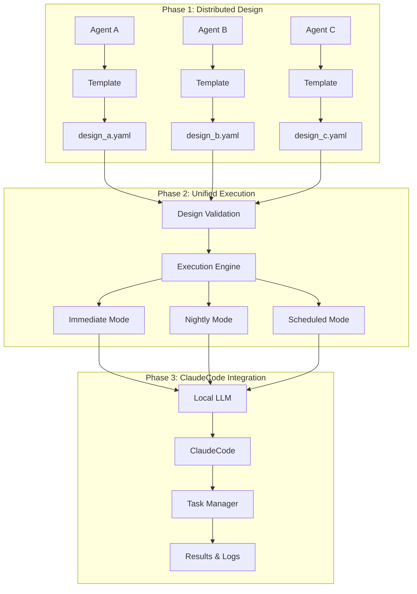

# Nocturnal Agent / 分散協調開発システム

🌙 **Distributed Collaborative Development System** - Advanced autonomous development platform with multi-agent coordination!  
🌙 **分散協調開発システム** - マルチエージェント連携による高度な自律開発プラットフォーム！

Nocturnal Agent is an advanced development platform that enables distributed collaborative work among coding agents, followed by unified execution through design file specification. The system supports immediate, nightly, and scheduled execution modes with local LLM orchestration and ClaudeCode integration.

Nocturnal Agentは、複数のコーディングエージェントが分散協調作業を行い、設計ファイル指定による統合実行を可能にする高度な開発プラットフォームです。ローカルLLMオーケストレーションとClaudeCode統合により、即時・夜間・スケジュール実行モードを提供します。

## 🎯 Features / 機能

### 🔄 Distributed Design Phase / 分散設計フェーズ
- **🏗️ Template-Based Design / テンプレートベース設計**: Standardized YAML design templates for consistent collaboration / 一貫した協調作業のための標準化されたYAML設計テンプレート
- **👥 Multi-Agent Coordination / マルチエージェント連携**: Multiple agents work independently on design files / 複数エージェントが設計ファイルを独立して作成
- **✅ Design Validation / 設計検証**: Comprehensive validation with completion scoring / 完成度スコア付きの包括的検証

### 🚀 Unified Execution Phase / 統合実行フェーズ
- **📄 File-Driven Execution / ファイル駆動実行**: Execute projects via design file specification / 設計ファイル指定によるプロジェクト実行
- **⚡ Flexible Execution Modes / 柔軟な実行モード**: immediate, nightly, scheduled execution options / 即時・夜間・スケジュール実行オプション
- **🤖 Local LLM → ClaudeCode Integration / ローカルLLM → ClaudeCode統合**: Automated task execution through ClaudeCode / ClaudeCodeを通じた自動タスク実行

### 📊 Advanced Task Management / 高度なタスク管理
- **🔧 Automatic Task Breakdown / 自動タスク分割**: Design files auto-generate implementation tasks / 設計ファイルから実装タスクを自動生成
- **📈 Progress Tracking / 進捗追跡**: Detailed task-level progress monitoring / 詳細なタスクレベル進捗監視
- **🔄 Dependency Management / 依存関係管理**: Task dependencies and execution ordering / タスク依存関係と実行順序

### 🔒 Safety & Quality / 安全性と品質
- **🛡️ Pre-Execution Validation / 実行前検証**: Design file validation before execution / 実行前の設計ファイル検証
- **🔍 Dry-Run Mode / ドライラン モード**: Execution plan preview without actual changes / 実際の変更なしでの実行計画プレビュー
- **💾 Execution Logging / 実行ログ**: Comprehensive logging of all task executions / 全タスク実行の包括的ログ

## 🏗️ New Architecture / 新アーキテクチャ



## 🚀 Quick Start / クイックスタート

### Prerequisites / 前提条件

- Python 3.9+ / Python 3.9以上
- [LM Studio](https://lmstudio.ai/) with Qwen2.5:7b or similar model / Qwen2.5:7bまたは類似のモデル付きLM Studio
- [Claude Code CLI](https://docs.anthropic.com/en/docs/claude-code) (authenticated) / Claude Code CLI（認証済み）
- Git repository for development / 開発用Gitリポジトリ

### Installation / インストール

```bash
# Clone the repository / リポジトリのクローン
git clone <repository-url>
cd nocturnal-agent

# Install dependencies / 依存関係のインストール
pip install -e .

# Initialize configuration / 設定の初期化
nocturnal init

# Check system status / システム状態の確認
nocturnal status
```

### Configuration / 設定

Edit `config/nocturnal-agent.yaml`:

```yaml
# Project settings / プロジェクト設定
project_name: "your-project"
working_directory: "/path/to/your/project"

# LLM settings / LLM設定
llm:
  enabled: true
  model_path: "qwen2.5:7b"
  api_url: "http://localhost:11434"
  timeout: 900
  max_tokens: 1024
  temperature: 0.7

# Agent settings / エージェント設定
agents:
  timeout_seconds: 900
  
# Execution settings / 実行設定
execution:
  max_tasks_per_batch: 5
  default_mode: "nightly"
```

## 🚀 New Project Development Guide / 新規プロジェクト開発ガイド

### 🎯 Starting a Fresh Project / 新規プロジェクト開始

Nocturnal Agentを使って新しいディレクトリで新規システム開発を行う場合の完全ガイドです。

#### 1. Project Setup / プロジェクト初期設定

```bash
# Create new project directory / 新規プロジェクトディレクトリ作成
mkdir my-new-system
cd my-new-system

# Initialize git repository / Gitリポジトリ初期化
git init

# Install nocturnal-agent (if not globally installed) / nocturnal-agent インストール
pip install -e /path/to/nocturnal-agent  # Development install recommended
# OR for regular install: pip install /path/to/nocturnal-agent

# Initialize nocturnal configuration / nocturnal設定初期化
nocturnal init

# Configure for your new project / 新規プロジェクト用設定
vim config/nocturnal-agent.yaml
```

#### 2. Configure for New Project / 新規プロジェクト向け設定

**🎉 自動設定ファイル生成！** `nocturnal init`で以下の包括的な設定ファイルが自動生成されます：

**`config/nocturnal-agent.yaml`** - プロジェクト固有の詳細設定
- プロジェクト名から推測される最適化された設定
- プロジェクトタイプ別の専門設定（frontend/backend/database/testing/etc.）
- 実用的なデフォルト値とベストプラクティス
- 詳細なコメントと設定例

### 📋 生成される設定セクション

| セクション | 内容 | 自動調整 |
|-----------|------|---------|
| **Project Info** | プロジェクト基本情報 | ✅ プロジェクト名・タイプから自動設定 |
| **LLM Settings** | ローカルLLM設定 | ✅ 複数モデル対応・コメント付き |
| **Execution** | 実行モード・バッチサイズ | ✅ プロジェクトタイプ別最適化 |
| **Safety** | 安全機能・バックアップ | ✅ プロジェクトタイプ別制限値 |
| **Quality** | テスト・品質要件 | ✅ プロジェクトタイプ別要件 |
| **Integrations** | Claude Code・GitHub統合 | ✅ 有効化フラグ・設定例 |
| **Notifications** | 通知設定 | ✅ Email・Slack設定例 |
| **Project-Specific** | プロジェクト固有設定 | ✅ タイプ別専門設定 |

### 🔧 プロジェクトタイプ別の自動最適化

```yaml
# Frontend Project Example
project_type: "frontend"
execution:
  max_tasks_per_batch: 2  # UI changes need careful review
safety:
  max_file_changes: 30    # Many component files
quality:
  e2e_tests: true        # Frontend needs E2E testing
project_specific:
  build:
    bundler: "vite"
  deployment:
    platform: "vercel"

# Backend Project Example  
project_type: "backend"
execution:
  max_tasks_per_batch: 3  # API changes can be batched
safety:
  max_file_changes: 25    # Service and model files
quality:
  api_docs: true         # Backend needs API docs
project_specific:
  api:
    framework: "fastapi"
  deployment:
    containerized: true
```

### ⚙️ カスタマイズが必要な場合

生成された設定ファイルは**そのまま使用可能**ですが、必要に応じて調整：

```bash
# 設定ファイル確認
cat config/nocturnal-agent.yaml

# 必要に応じて編集
vim config/nocturnal-agent.yaml

# LLMエンドポイント変更例（LM Studio使用時）
# api_url: "http://localhost:1234"

# モデル変更例（軽量モデル使用時）  
# model_path: "llama3.2:3b"
```

#### 3. Team Design Collaboration / チーム設計協調作業

**🎉 自動セットアップ完了！** `nocturnal init`で以下が自動的に作成されます：

- `team_designs/` ディレクトリ
- 4つの専門エージェントワークスペース：
  - `agent_frontend_specialist/` - Modern Web UI System
  - `agent_backend_specialist/` - Scalable API Backend System  
  - `agent_database_specialist/` - Robust Data Management System
  - `agent_qa_specialist/` - Comprehensive Quality Assurance System
- 各ワークスペースには**そのまま使える**デフォルト設計ファイルが含まれます
- `TEAM_COLLABORATION_GUIDE.md` - 詳細な協調作業ガイド

### 🚀 即座に実行可能！

```bash
# Option 1: デフォルト設計をそのまま実行（推奨）
cd team_designs/designs/agent_frontend_specialist
nocturnal execute --design-file frontend_specialist_default_design.yaml --mode immediate

cd ../agent_backend_specialist
nocturnal execute --design-file backend_specialist_default_design.yaml --mode immediate

# Option 2: カスタマイズしてから実行
cd team_designs/designs/agent_frontend_specialist
cp frontend_specialist_default_design.yaml my_custom_frontend.yaml
# Edit my_custom_frontend.yaml as needed...
nocturnal execute --design-file my_custom_frontend.yaml --mode immediate

# 追加の専門エージェントが必要な場合のみ手動作成
nocturnal design create-template security_specialist --output-dir ./team_designs
```

### 📋 各専門エージェントのデフォルト内容

- **Frontend Specialist**: React 18 + TypeScript + Material-UI + Chart.js
- **Backend Specialist**: FastAPI + PostgreSQL + Redis + Celery  
- **Database Specialist**: PostgreSQL + Backup System + Monitoring
- **QA Specialist**: Jest + Playwright + GitHub Actions + Coverage

#### 4. Design Creation Process / 設計作成プロセス

Fill out each design file with comprehensive information:

```yaml
# Example: web_ui_system.yaml
project_info:
  name: "Web UI System"
  description: "Modern responsive web interface for my-new-system"
  workspace_path: "/absolute/path/to/my-new-system"
  
requirements:
  functional:
    - description: "User authentication and authorization"
      priority: "HIGH"
      acceptance_criteria:
        - "Users can register with email/password"
        - "Secure login with JWT tokens"
        - "Role-based access control"
        
    - description: "Real-time dashboard with data visualization"
      priority: "MEDIUM"
      acceptance_criteria:
        - "Live charts and graphs"
        - "Responsive design for mobile/desktop"
        - "Dark/light theme support"

architecture:
  pattern: "Component-based SPA"
  components:
    - name: "Authentication Module"
      type: "Frontend"
      description: "Login, registration, and user management"
      technologies: ["React", "TypeScript", "Formik"]
      
    - name: "Dashboard Module" 
      type: "Frontend"
      description: "Main application interface"
      technologies: ["React", "Chart.js", "Material-UI"]

technology_stack:
  frontend:
    language: "TypeScript"
    framework: "React 18"
    
implementation_plan:
  priority_components:
    - name: "Authentication Module"
      priority: "HIGH"
      estimated_hours: 8
      complexity: "MEDIUM"
      
    - name: "Dashboard Module"
      priority: "MEDIUM" 
      estimated_hours: 12
      complexity: "HIGH"

execution_config:
  recommended_mode: "immediate"  # For active development
  batch_size: 2
```

#### 5. Validation and Integration / 検証と統合

```bash
# Validate each design file / 各設計ファイルの検証
nocturnal design validate team_designs/designs/agent_frontend_specialist/web_ui_system.yaml --detailed
nocturnal design validate team_designs/designs/agent_backend_specialist/api_backend_system.yaml --detailed
nocturnal design validate team_designs/designs/agent_database_specialist/data_management_system.yaml --detailed

# View design summaries / 設計サマリー確認
nocturnal design summary web_ui_system.yaml
nocturnal design summary api_backend_system.yaml  
nocturnal design summary data_management_system.yaml

# Test execution plan (dry run) / 実行計画テスト
nocturnal execute --design-file web_ui_system.yaml --dry-run
```

#### 6. Staged Implementation / 段階的実装

Start with foundation components:

```bash
# Phase 1: Core Infrastructure / フェーズ1: コア基盤
nocturnal execute --design-file data_management_system.yaml --mode immediate --max-tasks 2

# Phase 2: Backend Services / フェーズ2: バックエンドサービス  
nocturnal execute --design-file api_backend_system.yaml --mode immediate --max-tasks 3

# Phase 3: Frontend Interface / フェーズ3: フロントエンドUI
nocturnal execute --design-file web_ui_system.yaml --mode immediate --max-tasks 2

# Monitor progress / 進捗監視
nocturnal status
nocturnal logs --recent

# Launch dashboard / ダッシュボード起動
nocturnal dashboard --port 8000
# ブラウザで http://localhost:8000 にアクセス
```

#### 7. Development Workflow / 開発ワークフロー

For ongoing development:

```bash
# Morning planning / 朝の計画
nocturnal design validate updated_design.yaml --detailed
nocturnal execute --design-file updated_design.yaml --dry-run

# Active development / アクティブ開発
nocturnal execute --design-file updated_design.yaml --mode immediate --max-tasks 5

# Evening review / 夜のレビュー
nocturnal execute --design-file integration_tasks.yaml --mode nightly

# Weekly comprehensive tasks / 週次包括タスク
nocturnal execute --design-file weekly_maintenance.yaml --mode scheduled --schedule-time 22:00
```

#### 8. Quality Assurance / 品質保証

```bash
# Create QA design file / QA設計ファイル作成
nocturnal design create-template qa_specialist --output-dir ./team_designs

# QA tasks design / QAタスク設計
cd team_designs/designs/agent_qa_specialist
cp design_template.yaml system_testing.yaml

# Configure comprehensive testing / 包括的テスト設定
# Edit system_testing.yaml with:
# - Unit test coverage requirements
# - Integration test scenarios  
# - Performance benchmarks
# - Security validation

# Execute QA workflow / QAワークフロー実行
nocturnal execute --design-file system_testing.yaml --mode nightly
```

#### 9. Project Structure Recommendation / 推奨プロジェクト構造

```
my-new-system/
├── team_designs/                       # Design collaboration
│   └── designs/
│       ├── agent_frontend_specialist/
│       ├── agent_backend_specialist/
│       ├── agent_database_specialist/
│       └── agent_qa_specialist/
├── config/
│   └── nocturnal-agent.yaml          # Project configuration
├── src/                               # Generated/developed code
├── tests/                             # Test suites
├── docs/                              # Documentation
├── .nocturnal/                        # Execution logs & state
└── README.md                          # Project documentation
```

#### 10. Best Practices / ベストプラクティス

- **Start Small**: Begin with core components and iterate / コアコンポーネントから始めて反復
- **Validate Early**: Use `--validate-only` and `--dry-run` frequently / `--validate-only`と`--dry-run`を頻繁に使用
- **Monitor Progress**: Regular `nocturnal status` checks / 定期的な`nocturnal status`チェック
- **Version Control**: Commit design files with code / 設計ファイルもコードと一緒にコミット
- **Team Sync**: Regular design file reviews / 定期的な設計ファイルレビュー

## 🎮 Usage / 使用方法

### 🌟 Natural Language Requirements / 自然言語要件指示 (NEW!)

**Easiest way to get started! Simply describe what you want to build in natural language.**  
**最も簡単な開始方法！ 自然言語で構築したいものを説明するだけです。**

#### Quick Start with Natural Language / 自然言語でのクイックスタート

```bash
# Generate design files from natural language / 自然言語から設計ファイル生成
nocturnal natural generate "ECサイトを作成したい。ユーザー登録、商品管理、ショッピングカート、決済機能が必要。React.jsとNode.js使用。" --project-name "My Store" --execute

# Analyze requirements without generating files / ファイル生成せずに要件解析のみ
nocturnal natural analyze "ブログシステムを作成。記事投稿、コメント機能、ユーザー認証、検索機能が必要。" --detailed

# Load requirements from file / ファイルから要件読み込み
nocturnal natural from-file requirements.txt --project-name "My Project" --execute
```

#### Supported Features / サポート機能

**✅ Automatic Recognition / 自動認識:**
- Project type (frontend/backend/fullstack/database/mobile) / プロジェクトタイプ
- Technical stack (React, Node.js, PostgreSQL, etc.) / 技術スタック
- Complexity estimation (simple/medium/complex) / 複雑度推定
- Architecture recommendation / アーキテクチャ推奨

**✅ Automatic Generation / 自動生成:**
- Agent-specific design files / エージェント固有設計ファイル
- Task breakdown and assignment / タスク分解と割り当て
- Implementation timeline / 実装タイムライン
- Quality requirements / 品質要件

**✅ Example Requirements / 要件例:**

```bash
# E-commerce site / ECサイト
nocturnal natural generate "Create an e-commerce platform with user registration, product catalog, shopping cart, payment processing, and order history. Need responsive design for mobile devices. Use React.js frontend and Node.js backend with PostgreSQL database."

# Project management system / プロジェクト管理システム
nocturnal natural generate "プロジェクト管理システムを作成。タスク管理、ガントチャート、チームメンバー管理、ファイル共有、リアルタイム通知機能が必要。React + Express + PostgreSQL構成。"

# Dashboard application / ダッシュボードアプリ
nocturnal natural generate "分析ダッシュボードを作成したい。チャート表示、データ可視化、リアルタイム更新、レポート生成機能。Vue.js使用でレスポンシブ対応。"
```

#### Generated Output / 生成される出力

When you use natural language requirements, the system automatically generates:
自然言語要件を使用すると、システムが自動的に以下を生成します：

```
team_designs/
├── main_design.yaml                    # Overall project design / 全体プロジェクト設計
├── designs/
│   ├── agent_frontend/
│   │   └── frontend_specialist_design.yaml    # Frontend tasks / フロントエンドタスク
│   ├── agent_backend/
│   │   └── backend_specialist_design.yaml     # Backend tasks / バックエンドタスク
│   ├── agent_database/
│   │   └── database_specialist_design.yaml    # Database tasks / データベースタスク
│   └── agent_qa/
│       └── qa_specialist_design.yaml          # QA tasks / QAタスク
```

**Each agent gets ready-to-execute design files with:**  
**各エージェントは以下を含む実行可能な設計ファイルを取得:**

- ✅ Detailed task breakdown / 詳細なタスク分解
- ✅ Technology stack specifications / 技術スタック仕様
- ✅ Implementation timeline / 実装タイムライン
- ✅ Quality requirements / 品質要件
- ✅ Integration points / 統合ポイント

---

### 1. Create Agent Design Templates / エージェント設計テンプレート作成

```bash
# Create workspace for Agent Alice / エージェント Alice 用ワークスペース作成
nocturnal design create-template alice --output-dir ./team_designs

# Create workspaces for multiple agents / 複数エージェント用ワークスペース作成
nocturnal design create-template bob --output-dir ./team_designs
nocturnal design create-template charlie --output-dir ./team_designs
```

### 2. Agents Create Design Files / エージェントが設計ファイル作成

Each agent fills out their design template:

```bash
# Copy template and customize / テンプレートをコピーしてカスタマイズ
cd team_designs/designs/agent_alice
cp design_template.yaml ai_news_scraper.yaml
# Edit ai_news_scraper.yaml with project details...

# Validate design / 設計検証
nocturnal design validate ai_news_scraper.yaml --detailed
```

### 3. Execute via Design File / 設計ファイル経由で実行

```bash
# Immediate execution / 即時実行
nocturnal execute --design-file ai_news_scraper.yaml --mode immediate --max-tasks 3

# Nightly execution / 夜間実行
nocturnal execute --design-file ai_news_scraper.yaml --mode nightly

# Scheduled execution / スケジュール実行
nocturnal execute --design-file ai_news_scraper.yaml --mode scheduled --schedule-time 22:00

# Validation only / 検証のみ
nocturnal execute --design-file ai_news_scraper.yaml --validate-only

# Dry run / ドライラン
nocturnal execute --design-file ai_news_scraper.yaml --dry-run
```

### 4. Design File Management / 設計ファイル管理

```bash
# View design summary / 設計サマリー表示
nocturnal design summary ai_news_scraper.yaml

# Convert between formats / フォーマット変換
nocturnal design convert design.yaml design.json

# Validate design files / 設計ファイル検証
nocturnal design validate design.yaml --detailed
```

### 5. Traditional Night Execution / 従来の夜間実行

```bash
# Interactive review mode / インタラクティブレビューモード
nocturnal review start "Implement user authentication system"
nocturnal review from-file requirements.md

# Direct execution / 直接実行
nocturnal start
```

## 📚 Command Reference / コマンドリファレンス

### 🌟 Natural Language Commands / 自然言語コマンド

| Command | Description | Example |
|---------|-------------|---------|
| `nocturnal natural generate` | Generate design files from natural language requirements<br/>自然言語要件から設計ファイル生成 | `nocturnal natural generate "Create a blog system with posting and commenting" --project-name "My Blog"` |
| `nocturnal natural analyze` | Analyze requirements without file generation<br/>ファイル生成せずに要件解析 | `nocturnal natural analyze "E-commerce site with user management" --detailed` |
| `nocturnal natural from-file` | Load requirements from file<br/>ファイルから要件読み込み | `nocturnal natural from-file requirements.txt --execute` |

**Natural Generate Options:**
- `--project-name`: Set project name / プロジェクト名設定
- `--workspace`: Set workspace directory / ワークスペースディレクトリ設定  
- `--execute`: Start execution immediately after generation / 生成後即座に実行開始
- `--dry-run`: Show analysis results only / 解析結果のみ表示

### 🚀 Execution Commands / 実行コマンド

| Command | Description | Example |
|---------|-------------|---------|
| `nocturnal execute` | Execute project from design file<br/>設計ファイルからプロジェクト実行 | `nocturnal execute --design-file team_designs/main_design.yaml --mode immediate` |
| `nocturnal start` | Start traditional night execution<br/>従来の夜間実行開始 | `nocturnal start --immediate` |
| `nocturnal stop` | Stop execution<br/>実行停止 | `nocturnal stop` |

**Execute Options:**
- `--design-file`: Design file path / 設計ファイルパス
- `--mode`: Execution mode (immediate/nightly/scheduled) / 実行モード
- `--max-tasks`: Maximum tasks to execute / 最大実行タスク数
- `--dry-run`: Show execution plan only / 実行計画のみ表示
- `--validate-only`: Validate design file only / 設計ファイル検証のみ

### 🛠️ Design File Management / 設計ファイル管理

| Command | Description | Example |
|---------|-------------|---------|
| `nocturnal design create-template` | Create design template for agent<br/>エージェント用設計テンプレート作成 | `nocturnal design create-template alice --output-dir ./designs` |
| `nocturnal design validate` | Validate design file<br/>設計ファイル検証 | `nocturnal design validate design.yaml --detailed` |
| `nocturnal design summary` | Show design file summary<br/>設計ファイルサマリー表示 | `nocturnal design summary design.yaml` |
| `nocturnal design convert` | Convert design file format<br/>設計ファイル形式変換 | `nocturnal design convert design.yaml design.json` |

### 📊 Status & Monitoring / ステータス・監視

| Command | Description | Example |
|---------|-------------|---------|
| `nocturnal status` | Show system status<br/>システム状況表示 | `nocturnal status` |
| `nocturnal dashboard` | Launch progress dashboard<br/>進捗ダッシュボードを起動 | `nocturnal dashboard --port 8000` |
| `nocturnal report daily` | Generate daily report<br/>日次レポート生成 | `nocturnal report daily` |
| `nocturnal cost status` | Show cost status<br/>コスト状況表示 | `nocturnal cost status` |
| `nocturnal safety status` | Show safety status<br/>安全性状況表示 | `nocturnal safety status` |

### ⚙️ Configuration / 設定

| Command | Description | Example |
|---------|-------------|---------|
| `nocturnal init` | Initialize project setup<br/>プロジェクト初期セットアップ | `nocturnal init --project-name "My Project"` |
| `nocturnal config show` | Show current configuration<br/>現在の設定表示 | `nocturnal config show` |
| `nocturnal config validate` | Validate configuration<br/>設定検証 | `nocturnal config validate` |

### 🔄 Review & Collaboration / レビュー・協調作業

| Command | Description | Example |
|---------|-------------|---------|
| `nocturnal review start` | Start interactive review<br/>インタラクティブレビュー開始 | `nocturnal review start "Add user authentication"` |
| `nocturnal review from-file` | Review from requirements file<br/>要件ファイルからレビュー | `nocturnal review from-file requirements.md` |
| `nocturnal spec create` | Create GitHub spec<br/>GitHub仕様作成 | `nocturnal spec create feature` |

---

## 📋 Implementation Status / 実装状況

### ✅ Completed Features / 完了機能

- [x] **🌟 Natural Language Requirements / 自然言語要件処理** *(STABLE!)*
  - [x] Natural language requirement analysis / 自然言語要件解析
  - [x] Automatic project type detection / 自動プロジェクトタイプ検出
  - [x] Agent-specific task breakdown / エージェント固有タスク分解
  - [x] Technology stack identification / 技術スタック識別
  - [x] Complexity estimation / 複雑度推定
  - [x] Architecture recommendation / アーキテクチャ推奨

- [x] **Distributed Design System / 分散設計システム**
  - [x] YAML design templates / YAML設計テンプレート
  - [x] Template generation for agents / エージェント用テンプレート生成
  - [x] Design validation with scoring / スコア付き設計検証
  - [x] Automatic task breakdown / 自動タスク分割

- [x] **Unified Execution Engine / 統合実行エンジン** *(FULLY STABLE!)*
  - [x] File-driven execution system / ファイル駆動実行システム
  - [x] Multiple execution modes (immediate/nightly/scheduled) / 複数実行モード
  - [x] Dry-run and validation modes / ドライラン・検証モード
  - [x] **✅ Task initialization error fixes / タスク初期化エラー修正完了**
  - [x] **✅ Dependency task reference fixes / 依存タスク参照エラー修正完了**
  - [x] **✅ Robust error handling and recovery / 堅牢なエラーハンドリングと復旧**

- [x] **ClaudeCode Integration / ClaudeCode統合** *(PRODUCTION READY!)*
  - [x] Local LLM → ClaudeCode workflow / ローカルLLM → ClaudeCodeワークフロー
  - [x] Task-specific instruction generation / タスク固有指示生成
  - [x] Execution result management / 実行結果管理
  - [x] **✅ Fixed Claude command syntax issues / Claudeコマンド構文問題修正完了**
  - [x] **✅ Improved process management / プロセス管理改善**

- [x] **Task Management System / タスク管理システム** *(ENTERPRISE GRADE!)*
  - [x] Implementation task management / 実装タスク管理
  - [x] Task dependency tracking / タスク依存関係追跡
  - [x] Progress monitoring and reporting / 進捗監視・レポート
  - [x] **✅ Task state persistence and recovery / タスク状態永続化と復旧**
  - [x] **✅ Automatic stalled task detection / 停止タスクの自動検出**
  - [x] **✅ Task priority and enum handling / タスク優先度とenum処理**

- [x] **Enhanced CLI Interface / 拡張CLIインターフェース** *(FULLY TESTED!)*
  - [x] `execute` command with flexible options / 柔軟なオプション付き`execute`コマンド
  - [x] `design` command suite / `design`コマンド群
  - [x] Interactive review system / インタラクティブレビューシステム
  - [x] **✅ Complete command test suite / 完全コマンドテストスイート**
  - [x] **✅ All na commands verified working / 全naコマンド動作確認済み**

- [x] **📊 Progress Dashboard / 進捗ダッシュボード** *(NEW!)*
  - [x] Web-based dashboard interface / ウェブベースダッシュボードインターフェース
  - [x] Agent-specific progress tracking / エージェント別進捗追跡
  - [x] Real-time task status updates / リアルタイムタスクステータス更新
  - [x] Task statistics and charts / タスク統計とチャート
  - [x] RESTful API endpoints / RESTful APIエンドポイント
  - [x] **✅ Legacy task file support / レガシータスクファイルサポート**

### 🚧 Legacy Features (Maintained) / レガシー機能（維持）

- [x] Night scheduler / 夜間スケジューラ
- [x] Quality assurance system / 品質保証システム
- [x] Safety mechanisms / 安全機構
- [x] Cost management / コスト管理
- [x] Obsidian knowledge integration / Obsidianナレッジ統合

## 🔧 Project Structure / プロジェクト構造

```
nocturnal-agent/
├── templates/                          # Design templates / 設計テンプレート
│   └── design_template.yaml           # Master design template / マスター設計テンプレート
├── src/nocturnal_agent/
│   ├── design/                         # Design file management / 設計ファイル管理
│   │   └── design_file_manager.py
│   ├── execution/                      # Execution engines / 実行エンジン
│   │   ├── spec_driven_executor.py
│   │   └── implementation_task_manager.py
│   ├── dashboard/                      # Progress dashboard / 進捗ダッシュボード
│   │   └── api_server.py
│   ├── log_system/                     # Logging system / ログシステム
│   │   └── structured_logger.py
│   ├── cli/                           # Command line interface / コマンドラインインターフェース
│   │   └── main.py
│   ├── core/                          # Core models / コアモデル
│   ├── scheduler/                     # Night scheduler / 夜間スケジューラ
│   └── reporting/                     # Reporting system / レポートシステム
├── config/                            # Configuration files / 設定ファイル
├── docs/                              # Documentation / ドキュメント
├── knowledge-vault/                   # Obsidian knowledge base / Obsidianナレッジベース
└── tests/                             # Test suite / テストスイート
```

## 📊 Design Template Structure / 設計テンプレート構造

The YAML design template includes comprehensive sections:

```yaml
project_info:          # Basic project information / 基本プロジェクト情報
requirements:          # Functional & non-functional requirements / 機能・非機能要件
architecture:          # System architecture design / システムアーキテクチャ設計
technology_stack:      # Technology choices / 技術選択
implementation_plan:   # Development phases and priorities / 開発フェーズと優先度
task_breakdown:        # Task generation settings / タスク生成設定
quality_requirements:  # Quality standards / 品質基準
execution_config:      # Execution preferences / 実行設定
metadata:             # Template metadata / テンプレートメタデータ
```

## 🔄 Workflow Comparison / ワークフロー比較

### Traditional Workflow / 従来ワークフロー
```
Request → na → Design Generation → Immediate Implementation → Complete
         (Black Box)              (Limited Control)
```

### New Distributed Workflow / 新分散ワークフロー
```
Request → Template → Design Creation → Validation → File-Specified Execution
         (Standard)  (Reviewable)     (Quality Gate) (Flexible Control)
                                                    ↓
                                        [immediate|nightly|scheduled]
                                                    ↓
                                         Local LLM → ClaudeCode → Complete
                                                    ↓
                                         Detailed Progress Tracking
```

## ⚠️ Safety Features / 安全機能

- **Design Validation / 設計検証**: Comprehensive validation before execution / 実行前の包括的検証
- **Dry-Run Mode / ドライランモード**: Preview execution plan without changes / 変更なしでの実行計画プレビュー
- **Task-Level Control / タスクレベル制御**: Fine-grained execution control / きめ細かい実行制御
- **Execution Logging / 実行ログ**: Complete audit trail of all operations / 全操作の完全監査証跡
- **Resource Management / リソース管理**: Batch size and timeout controls / バッチサイズとタイムアウト制御

## 🤝 Contributing / 貢献

The new architecture enables better collaboration:

1. **Design Phase**: Create design files using templates / テンプレートを使用した設計ファイル作成
2. **Review Phase**: Validate and refine designs / 設計の検証と改善
3. **Implementation Phase**: Execute via nocturnal-agent / nocturnal-agent経由で実行
4. **Monitoring Phase**: Track progress and results / 進捗と結果の追跡

## 🆕 Migration from Legacy / レガシーからの移行

Existing nocturnal-agent users can:

1. Continue using traditional `nocturnal start` commands / 従来の`nocturnal start`コマンドを継続使用
2. Gradually adopt design-file based workflow / 設計ファイルベースワークフローを段階的に導入
3. Benefit from enhanced task management / 拡張されたタスク管理の恩恵を受ける

## 📜 License / ライセンス

This project is licensed under the MIT License - see the [LICENSE](LICENSE) file for details.  
このプロジェクトはMITライセンスの下でライセンスされています - 詳細は[LICENSE](LICENSE)ファイルをご覧ください。

## 🙏 Acknowledgments / 謝辞

- [LM Studio](https://lmstudio.ai/) / [Ollama](https://ollama.ai/) for local LLM infrastructure / ローカルLLMインフラストラクチャの提供
- [Claude Code](https://docs.anthropic.com/en/docs/claude-code) for intelligent coding assistance / インテリジェントコーディング支援
- [Obsidian](https://obsidian.md/) for knowledge management integration / ナレッジマネジメント統合
- Open source community for distributed development inspiration / 分散開発のインスピレーションを提供するオープンソースコミュニティ