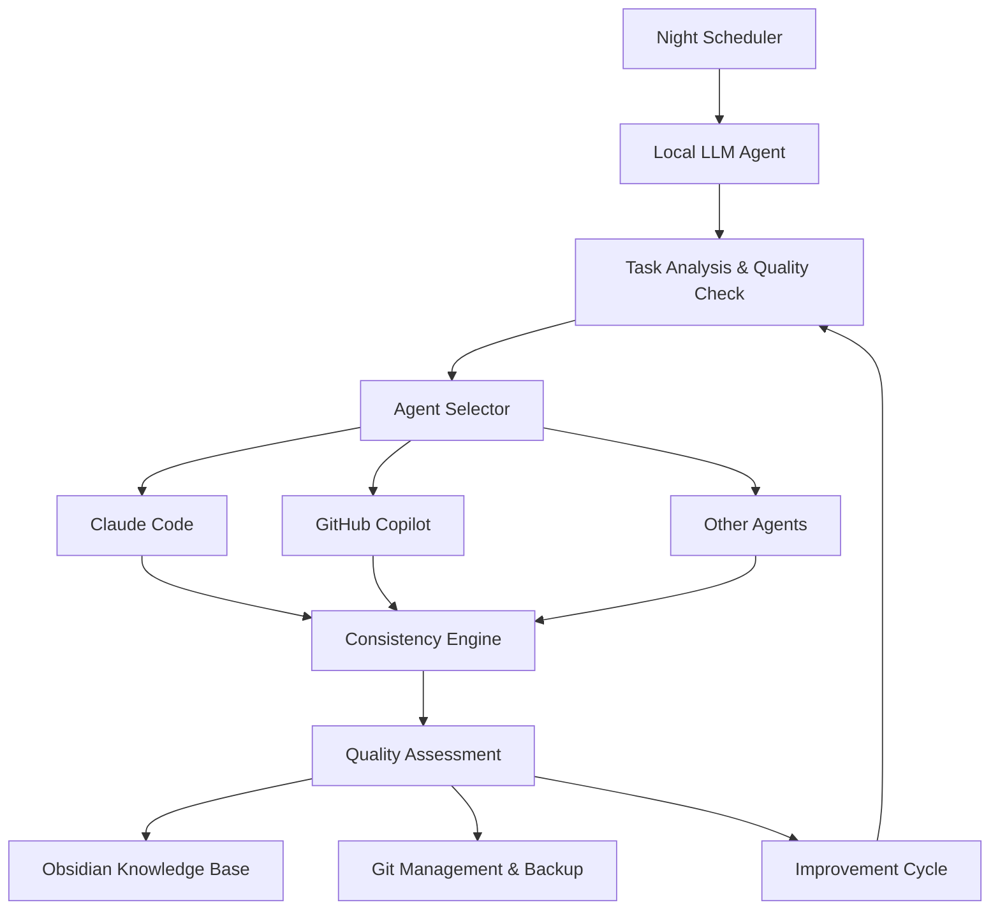

# Nocturnal Agent

🌙 **Autonomous Night Development System** - Let your code write itself while you sleep!

Nocturnal Agent is an intelligent system that performs development tasks autonomously during nighttime hours (10 PM - 6 AM), using local LLM orchestration with multi-agent coordination for cost-effective and safe automated coding.

## 🎯 Features

- **🌙 Night Automation**: Automatic execution during 22:00-06:00 window
- **🤖 Multi-Agent Orchestration**: Coordinates Claude Code, GitHub Copilot, and other coding agents
- **🧠 Local LLM Intelligence**: Uses LM Studio for cost-effective task planning and quality assessment
- **📊 Quality Assurance**: Maintains 0.85+ quality threshold with 3-cycle improvement system
- **🔒 Safety First**: Automatic backups, dangerous command blocking, resource limits
- **💡 Learning System**: Obsidian-based knowledge accumulation for project-specific patterns
- **⚖️ Cost Control**: $10/month budget with 90%+ free tool preference
- **🔀 Parallel Execution**: Up to 5 concurrent branches based on quality confidence

## 🚀 Quick Start

### Prerequisites

- Python 3.9+
- [LM Studio](https://lmstudio.ai/) with a code model (recommended: CodeLlama 13B)
- [Claude Code CLI](https://docs.anthropic.com/en/docs/claude-code) (authenticated)
- Git repository for development

### Installation

```bash
# Clone the repository
git clone <repository-url>
cd nocturnal-agent

# Install dependencies
pip install -e .

# Initialize configuration
nocturnal init

# Check system status
nocturnal status
```

### Configuration

Edit `config/nocturnal-agent.yaml` to customize:

```yaml
# Core settings
project_name: "your-project"
working_directory: "/path/to/your/project"

# LLM settings
llm:
  api_url: "http://localhost:1234/v1"
  model_path: "models/codellama-13b"

# Night schedule
scheduler:
  start_time: "22:00"
  end_time: "06:00"
  max_changes_per_night: 10

# Quality thresholds
quality:
  overall_threshold: 0.85
  consistency_threshold: 0.85
```

## 🏗️ Architecture



## 📋 Current Implementation Status

- [x] 1. Project foundation and core interfaces
  - [x] Python 3.9+ project structure (src/, tests/, config/)
  - [x] Basic data models (Task, QualityScore, ExecutionResult, ProjectContext)
  - [x] Configuration management system (YAML support)

- [ ] 2. Local LLM Agent implementation
- [ ] 3. CLI coding agent integration system
- [ ] 4. Consistency engine implementation
- [ ] 5. Obsidian integration system
- [ ] 6. Quality improvement cycle implementation
- [ ] 7. Night scheduler implementation
- [ ] 8. Safety and backup system implementation
- [ ] 9. Cost management system implementation
- [ ] 10. Parallel execution features
- [ ] 11. Test suite implementation
- [ ] 12. Configuration and documentation

## 🎮 Usage

### Adding Tasks

```bash
# Add a simple task
nocturnal add-task -t "Fix bug in user authentication" -p high

# Interactive task entry
nocturnal add-task
```

### Night Execution

```bash
# Test run (dry run)
nocturnal night-run --dry-run

# Actual night execution (normally runs automatically)
nocturnal night-run
```

### Monitoring

```bash
# Check system status
nocturnal status

# Validate configuration
nocturnal config-check

# View execution logs
tail -f logs/nocturnal-agent.log
```

## 🔧 Development

### Setting up Development Environment

```bash
# Install development dependencies
pip install -e ".[dev]"

# Install pre-commit hooks
pre-commit install

# Run tests
pytest

# Type checking
mypy src/

# Code formatting
black src/ tests/
isort src/ tests/
```

### Project Structure

```
nocturnal-agent/
├── src/nocturnal_agent/           # Main source code
│   ├── core/                      # Core models and interfaces
│   ├── agents/                    # Agent implementations
│   ├── engines/                   # Consistency and quality engines
│   ├── managers/                  # System managers
│   ├── schedulers/                # Night scheduler
│   ├── safety/                    # Safety mechanisms
│   └── utils/                     # Utilities
├── tests/                         # Test suite
│   ├── unit/                      # Unit tests
│   ├── integration/               # Integration tests
│   └── e2e/                       # End-to-end tests
├── config/                        # Configuration files
├── docs/                          # Documentation
└── knowledge-vault/               # Obsidian knowledge base
```

## ⚠️ Safety Features

- **Automatic Backups**: Full repository backup before night execution
- **Resource Limits**: CPU 80%, Memory 8GB limits
- **Dangerous Command Blocking**: Prevents destructive operations
- **File Change Limits**: Maximum 20 file changes per task
- **Git Branch Isolation**: All work done in dedicated branches
- **Quality Gates**: 0.85+ quality threshold for automatic application

## 🤝 Contributing

1. Fork the repository
2. Create a feature branch (`git checkout -b feature/amazing-feature`)
3. Commit your changes (`git commit -m 'Add amazing feature'`)
4. Push to the branch (`git push origin feature/amazing-feature`)
5. Open a Pull Request

## 📜 License

This project is licensed under the MIT License - see the [LICENSE](LICENSE) file for details.

## 🙏 Acknowledgments

- [LM Studio](https://lmstudio.ai/) for local LLM infrastructure
- [Claude Code](https://docs.anthropic.com/en/docs/claude-code) for intelligent coding assistance
- [Obsidian](https://obsidian.md/) for knowledge management inspiration