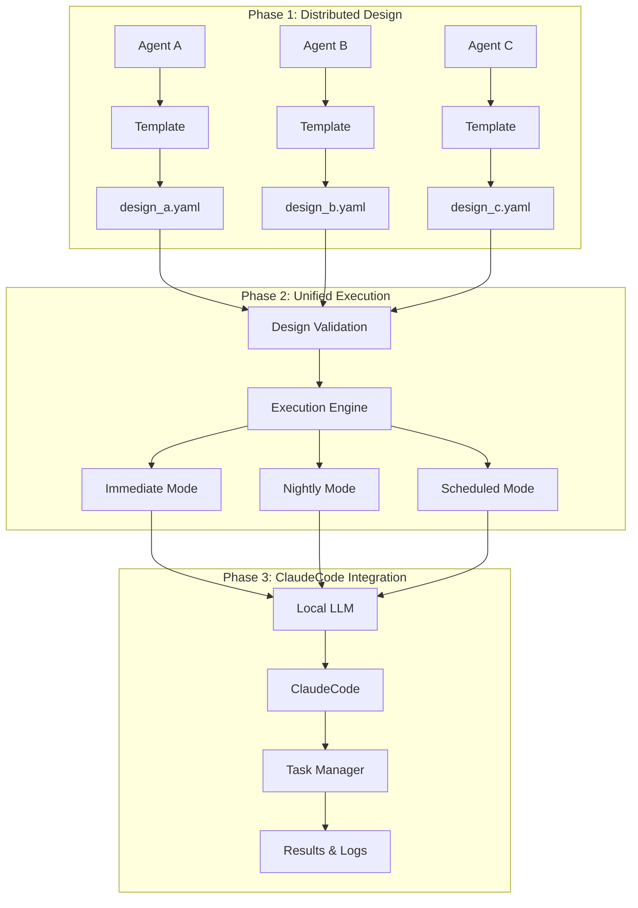

# Nocturnal Agent / 分散協調開発システム

🌙 **Distributed Collaborative Development System** - Advanced autonomous development platform with multi-agent coordination!  
🌙 **分散協調開発システム** - マルチエージェント連携による高度な自律開発プラットフォーム！

Nocturnal Agent is an advanced development platform that enables distributed collaborative work among coding agents, followed by unified execution through design file specification. The system supports immediate, nightly, and scheduled execution modes with local LLM orchestration and ClaudeCode integration.

Nocturnal Agentは、複数のコーディングエージェントが分散協調作業を行い、設計ファイル指定による統合実行を可能にする高度な開発プラットフォームです。ローカルLLMオーケストレーションとClaudeCode統合により、即時・夜間・スケジュール実行モードを提供します。

## 🎯 Features / 機能

### 🔄 Distributed Design Phase / 分散設計フェーズ
- **🏗️ Template-Based Design / テンプレートベース設計**: Standardized YAML design templates for consistent collaboration / 一貫した協調作業のための標準化されたYAML設計テンプレート
- **👥 Multi-Agent Coordination / マルチエージェント連携**: Multiple agents work independently on design files / 複数エージェントが設計ファイルを独立して作成
- **✅ Design Validation / 設計検証**: Comprehensive validation with completion scoring / 完成度スコア付きの包括的検証

### 🚀 Unified Execution Phase / 統合実行フェーズ
- **📄 File-Driven Execution / ファイル駆動実行**: Execute projects via design file specification / 設計ファイル指定によるプロジェクト実行
- **⚡ Flexible Execution Modes / 柔軟な実行モード**: immediate, nightly, scheduled execution options / 即時・夜間・スケジュール実行オプション
- **🤖 Local LLM → ClaudeCode Integration / ローカルLLM → ClaudeCode統合**: Automated task execution through ClaudeCode / ClaudeCodeを通じた自動タスク実行

### 📊 Advanced Task Management / 高度なタスク管理
- **🔧 Automatic Task Breakdown / 自動タスク分割**: Design files auto-generate implementation tasks / 設計ファイルから実装タスクを自動生成
- **📈 Progress Tracking / 進捗追跡**: Detailed task-level progress monitoring / 詳細なタスクレベル進捗監視
- **🔄 Dependency Management / 依存関係管理**: Task dependencies and execution ordering / タスク依存関係と実行順序

### 🔒 Safety & Quality / 安全性と品質
- **🛡️ Pre-Execution Validation / 実行前検証**: Design file validation before execution / 実行前の設計ファイル検証
- **🔍 Dry-Run Mode / ドライラン モード**: Execution plan preview without actual changes / 実際の変更なしでの実行計画プレビュー
- **💾 Execution Logging / 実行ログ**: Comprehensive logging of all task executions / 全タスク実行の包括的ログ

## 🏗️ New Architecture / 新アーキテクチャ



## 🚀 Quick Start / クイックスタート

### Prerequisites / 前提条件

- Python 3.9+ / Python 3.9以上
- [LM Studio](https://lmstudio.ai/) with Qwen2.5:7b or similar model / Qwen2.5:7bまたは類似のモデル付きLM Studio
- [Claude Code CLI](https://docs.anthropic.com/en/docs/claude-code) (authenticated) / Claude Code CLI（認証済み）
- Git repository for development / 開発用Gitリポジトリ

### Installation / インストール

```bash
# Clone the repository / リポジトリのクローン
git clone <repository-url>
cd nocturnal-agent

# Install dependencies / 依存関係のインストール
pip install -e .

# Initialize configuration / 設定の初期化
nocturnal init

# Check system status / システム状態の確認
nocturnal status
```

### Configuration / 設定

Edit `config/nocturnal-agent.yaml`:

```yaml
# Project settings / プロジェクト設定
project_name: "your-project"
working_directory: "/path/to/your/project"

# LLM settings / LLM設定
llm:
  enabled: true
  model_path: "qwen2.5:7b"
  api_url: "http://localhost:11434"
  timeout: 900
  max_tokens: 1024
  temperature: 0.7

# Agent settings / エージェント設定
agents:
  timeout_seconds: 900
  
# Execution settings / 実行設定
execution:
  max_tasks_per_batch: 5
  default_mode: "nightly"
```

## 🎮 Usage / 使用方法

### 1. Create Agent Design Templates / エージェント設計テンプレート作成

```bash
# Create workspace for Agent Alice / エージェント Alice 用ワークスペース作成
nocturnal design create-template alice --output-dir ./team_designs

# Create workspaces for multiple agents / 複数エージェント用ワークスペース作成
nocturnal design create-template bob --output-dir ./team_designs
nocturnal design create-template charlie --output-dir ./team_designs
```

### 2. Agents Create Design Files / エージェントが設計ファイル作成

Each agent fills out their design template:

```bash
# Copy template and customize / テンプレートをコピーしてカスタマイズ
cd team_designs/designs/agent_alice
cp design_template.yaml ai_news_scraper.yaml
# Edit ai_news_scraper.yaml with project details...

# Validate design / 設計検証
nocturnal design validate ai_news_scraper.yaml --detailed
```

### 3. Execute via Design File / 設計ファイル経由で実行

```bash
# Immediate execution / 即時実行
nocturnal execute --design-file ai_news_scraper.yaml --mode immediate --max-tasks 3

# Nightly execution / 夜間実行
nocturnal execute --design-file ai_news_scraper.yaml --mode nightly

# Scheduled execution / スケジュール実行
nocturnal execute --design-file ai_news_scraper.yaml --mode scheduled --schedule-time 22:00

# Validation only / 検証のみ
nocturnal execute --design-file ai_news_scraper.yaml --validate-only

# Dry run / ドライラン
nocturnal execute --design-file ai_news_scraper.yaml --dry-run
```

### 4. Design File Management / 設計ファイル管理

```bash
# View design summary / 設計サマリー表示
nocturnal design summary ai_news_scraper.yaml

# Convert between formats / フォーマット変換
nocturnal design convert design.yaml design.json

# Validate design files / 設計ファイル検証
nocturnal design validate design.yaml --detailed
```

### 5. Traditional Night Execution / 従来の夜間実行

```bash
# Interactive review mode / インタラクティブレビューモード
nocturnal review start "Implement user authentication system"
nocturnal review from-file requirements.md

# Direct execution / 直接実行
nocturnal start
```

## 📋 Implementation Status / 実装状況

### ✅ Completed Features / 完了機能

- [x] **Distributed Design System / 分散設計システム**
  - [x] YAML design templates / YAML設計テンプレート
  - [x] Template generation for agents / エージェント用テンプレート生成
  - [x] Design validation with scoring / スコア付き設計検証
  - [x] Automatic task breakdown / 自動タスク分割

- [x] **Unified Execution Engine / 統合実行エンジン**
  - [x] File-driven execution system / ファイル駆動実行システム
  - [x] Multiple execution modes (immediate/nightly/scheduled) / 複数実行モード
  - [x] Dry-run and validation modes / ドライラン・検証モード

- [x] **ClaudeCode Integration / ClaudeCode統合**
  - [x] Local LLM → ClaudeCode workflow / ローカルLLM → ClaudeCodeワークフロー
  - [x] Task-specific instruction generation / タスク固有指示生成
  - [x] Execution result management / 実行結果管理

- [x] **Task Management System / タスク管理システム**
  - [x] Implementation task management / 実装タスク管理
  - [x] Task dependency tracking / タスク依存関係追跡
  - [x] Progress monitoring and reporting / 進捗監視・レポート

- [x] **Enhanced CLI Interface / 拡張CLIインターフェース**
  - [x] `execute` command with flexible options / 柔軟なオプション付き`execute`コマンド
  - [x] `design` command suite / `design`コマンド群
  - [x] Interactive review system / インタラクティブレビューシステム

### 🚧 Legacy Features (Maintained) / レガシー機能（維持）

- [x] Night scheduler / 夜間スケジューラ
- [x] Quality assurance system / 品質保証システム
- [x] Safety mechanisms / 安全機構
- [x] Cost management / コスト管理
- [x] Obsidian knowledge integration / Obsidianナレッジ統合

## 🔧 Project Structure / プロジェクト構造

```
nocturnal-agent/
├── templates/                          # Design templates / 設計テンプレート
│   └── design_template.yaml           # Master design template / マスター設計テンプレート
├── src/nocturnal_agent/
│   ├── design/                         # Design file management / 設計ファイル管理
│   │   └── design_file_manager.py
│   ├── execution/                      # Execution engines / 実行エンジン
│   │   ├── spec_driven_executor.py
│   │   └── implementation_task_manager.py
│   ├── log_system/                     # Logging system / ログシステム
│   │   └── structured_logger.py
│   ├── cli/                           # Command line interface / コマンドラインインターフェース
│   │   └── main.py
│   ├── core/                          # Core models / コアモデル
│   ├── scheduler/                     # Night scheduler / 夜間スケジューラ
│   └── reporting/                     # Reporting system / レポートシステム
├── config/                            # Configuration files / 設定ファイル
├── docs/                              # Documentation / ドキュメント
├── knowledge-vault/                   # Obsidian knowledge base / Obsidianナレッジベース
└── tests/                             # Test suite / テストスイート
```

## 📊 Design Template Structure / 設計テンプレート構造

The YAML design template includes comprehensive sections:

```yaml
project_info:          # Basic project information / 基本プロジェクト情報
requirements:          # Functional & non-functional requirements / 機能・非機能要件
architecture:          # System architecture design / システムアーキテクチャ設計
technology_stack:      # Technology choices / 技術選択
implementation_plan:   # Development phases and priorities / 開発フェーズと優先度
task_breakdown:        # Task generation settings / タスク生成設定
quality_requirements:  # Quality standards / 品質基準
execution_config:      # Execution preferences / 実行設定
metadata:             # Template metadata / テンプレートメタデータ
```

## 🔄 Workflow Comparison / ワークフロー比較

### Traditional Workflow / 従来ワークフロー
```
Request → na → Design Generation → Immediate Implementation → Complete
         (Black Box)              (Limited Control)
```

### New Distributed Workflow / 新分散ワークフロー
```
Request → Template → Design Creation → Validation → File-Specified Execution
         (Standard)  (Reviewable)     (Quality Gate) (Flexible Control)
                                                    ↓
                                        [immediate|nightly|scheduled]
                                                    ↓
                                         Local LLM → ClaudeCode → Complete
                                                    ↓
                                         Detailed Progress Tracking
```

## ⚠️ Safety Features / 安全機能

- **Design Validation / 設計検証**: Comprehensive validation before execution / 実行前の包括的検証
- **Dry-Run Mode / ドライランモード**: Preview execution plan without changes / 変更なしでの実行計画プレビュー
- **Task-Level Control / タスクレベル制御**: Fine-grained execution control / きめ細かい実行制御
- **Execution Logging / 実行ログ**: Complete audit trail of all operations / 全操作の完全監査証跡
- **Resource Management / リソース管理**: Batch size and timeout controls / バッチサイズとタイムアウト制御

## 🤝 Contributing / 貢献

The new architecture enables better collaboration:

1. **Design Phase**: Create design files using templates / テンプレートを使用した設計ファイル作成
2. **Review Phase**: Validate and refine designs / 設計の検証と改善
3. **Implementation Phase**: Execute via nocturnal-agent / nocturnal-agent経由で実行
4. **Monitoring Phase**: Track progress and results / 進捗と結果の追跡

## 🆕 Migration from Legacy / レガシーからの移行

Existing nocturnal-agent users can:

1. Continue using traditional `nocturnal start` commands / 従来の`nocturnal start`コマンドを継続使用
2. Gradually adopt design-file based workflow / 設計ファイルベースワークフローを段階的に導入
3. Benefit from enhanced task management / 拡張されたタスク管理の恩恵を受ける

## 📜 License / ライセンス

This project is licensed under the MIT License - see the [LICENSE](LICENSE) file for details.  
このプロジェクトはMITライセンスの下でライセンスされています - 詳細は[LICENSE](LICENSE)ファイルをご覧ください。

## 🙏 Acknowledgments / 謝辞

- [LM Studio](https://lmstudio.ai/) / [Ollama](https://ollama.ai/) for local LLM infrastructure / ローカルLLMインフラストラクチャの提供
- [Claude Code](https://docs.anthropic.com/en/docs/claude-code) for intelligent coding assistance / インテリジェントコーディング支援
- [Obsidian](https://obsidian.md/) for knowledge management integration / ナレッジマネジメント統合
- Open source community for distributed development inspiration / 分散開発のインスピレーションを提供するオープンソースコミュニティ